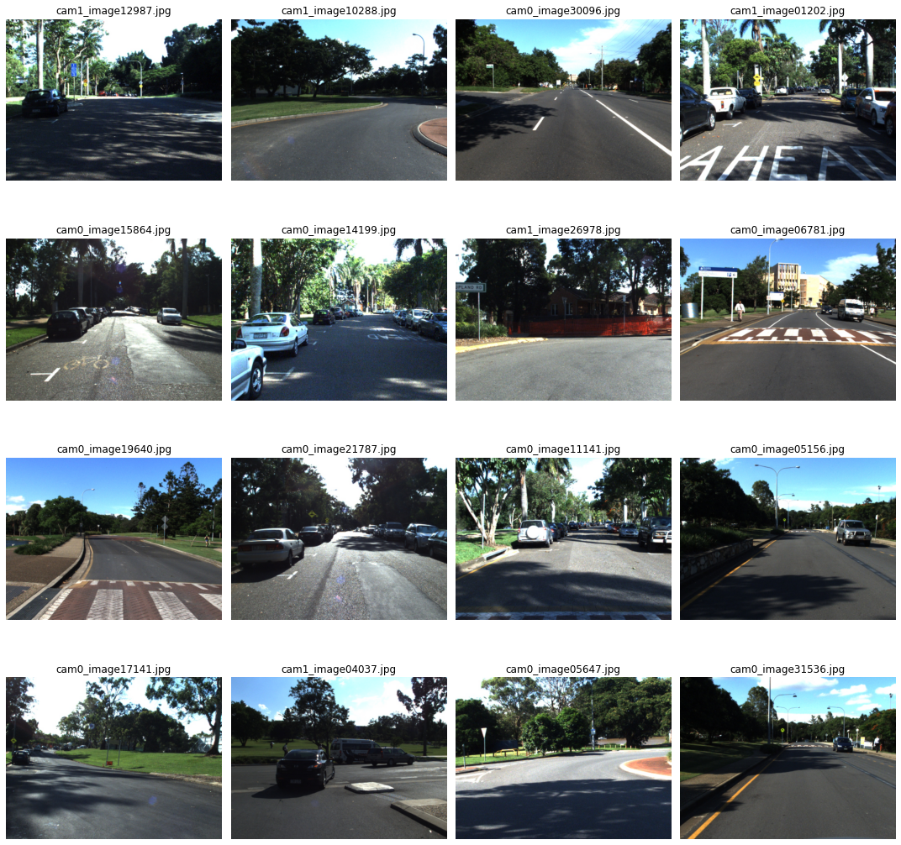

# St Lucia Scraper

Helps download, debayer and undistort [St. Lucia dataset](http://asrl.utias.utoronto.ca/~mdw/uqstluciadataset.html) images. 



## Quick Start

Note that this is [poetry](https://python-poetry.org/) based python repo, hence follow necessary steps to install dependencies and activate the environment before you continue.

1. Download

    ```
    sh download_dataset.py
    ```

1. Unrar downloaded `.rar` files

1. Debayer Undistort using [playground.ipynb](playground.ipynb)
